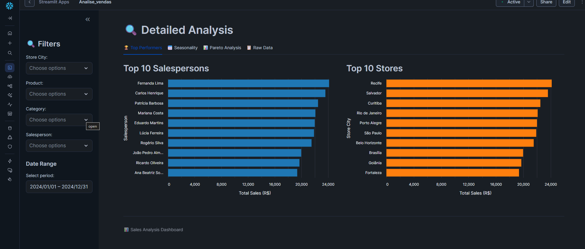
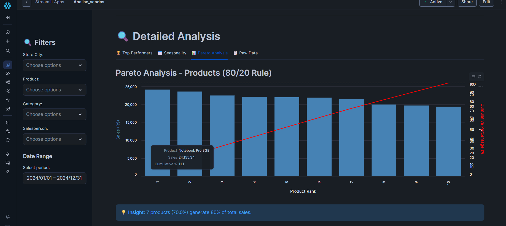

# sales analysis dashboard [snowflake + streamlit]

# Sales Analysis Dashboard

This project demonstrates a complete data analytics workflow integrating Snowflake as a data warehouse with Streamlit for interactive visualization. The dashboard provides real-time sales insights and performance metrics through optimized SQL queries and dynamic filtering.

## Project Overview

The application implements a full analytics cycle:

* **Extract**: Connects to Snowflake data warehouse to retrieve sales data.
* **Transform**: Executes optimized SQL queries with consolidated joins for performance.
* **Visualize**: Presents interactive charts and KPIs through a Streamlit web interface.
* **Filter**: Enables real-time data exploration with dynamic filtering capabilities.

## Technical Stack

* **Platform**: Snowflake (Data Warehouse)
* **Frontend**: Streamlit
* **Language**: Python and SQL
* **Visualization**: Plotly, Matplotlib

## Technical Features

### 1. Optimized Query Performance
* Consolidated database joins to reduce query execution time
* Efficient data retrieval strategies
* Pre-aggregated metrics for faster dashboard loading

### 2. Interactive Dashboard
* Real-time filtering by date range, product category, and region
* Dynamic KPI cards showing key sales metrics
* Interactive charts with drill-down capabilities

### 3. Snowflake Integration
* Secure connection using Streamlit secrets management
* Session management for efficient resource usage
* SQL-based transformations leveraging Snowflake's compute power

## Dashboard Preview

### Main Dashboard - KPIs and Sales Overview

*Key metrics: Total Revenue (R$ 216K), Transactions (366), Average Ticket (R$ 592), and sales breakdown by product and category.*

### Sales Trend Over Time

*Multi-line chart showing sales performance across different cities throughout the year.*

### Top Performers Analysis

*Rankings for top 10 salespersons and top 10 stores by total sales.*

### Pareto Analysis (80/20 Rule)

*Identifies that 7 products (70%) generate 80% of total sales, following the Pareto principle.*

### Seasonality Analysis

*Monthly sales patterns and quarterly performance breakdown.*